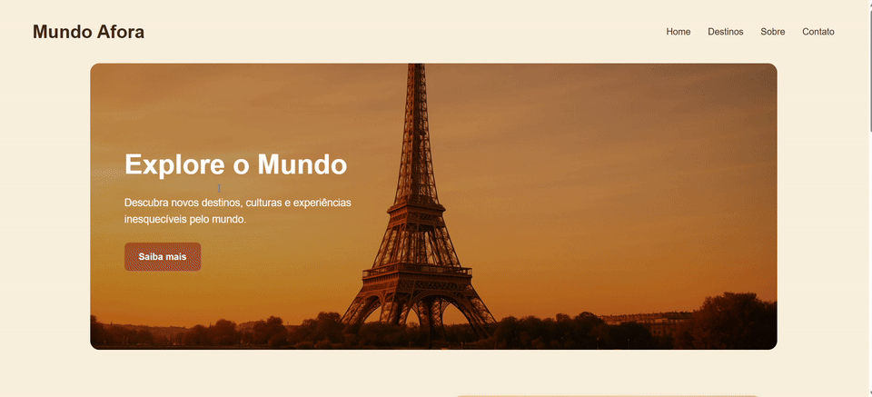

# PageTurismo

<p align="center">
  
</p>

<p align="center">
  Uma landing page de viagens com visual acolhedor, navegação simples e estrutura pronta para destacar destinos, histórias e chamadas para ação.
</p>

<p align="center">
  <a href="https://eloaguilgel.github.io/PageTurismo/">
    
  </a>
</p>

<p align="center">
  <strong>Seu próximo destino digital está aqui:</strong><br />
  <a href="https://eloaguilgel.github.io/PageTurismo/">eloaguilgel.github.io/PageTurismo</a>
</p>

## Sobre o projeto

O **PageTurismo** foi pensado como uma landing page simples para sites de viagens, turismo e experiências pelo mundo. A proposta é apresentar um layout elegante, direto e responsivo, com destaque para:

- seção hero com imagem de impacto;
- navegação clara e objetiva;
- bloco institucional "Sobre nós";
- vitrine de destinos populares;
- chamada final para contato.

Esse tipo de página funciona muito bem para agências, blogs de viagem, páginas promocionais e portfólios de destinos.

## CSS Grid na prática

Para deixar a seção de destinos mais flexível, o projeto agora usa **CSS Grid** na área dos cards. Isso facilita a distribuição automática dos blocos e melhora a adaptação entre telas grandes e pequenas.

```css
.destinos-container {
  display: grid;
  grid-template-columns: repeat(auto-fit, minmax(260px, 1fr));
  gap: 25px;
  align-items: stretch;
}
```

Com esse padrão, o grid pode ser usado em uma landing page de viagens para:

- organizar cards de destinos sem precisar definir larguras fixas;
- criar galerias de pacotes, roteiros ou experiências;
- montar seções de depoimentos, benefícios e categorias;
- manter a interface mais limpa e responsiva com menos ajustes manuais.

Em projetos de turismo, isso é especialmente útil porque o conteúdo costuma ser muito visual e precisa se reorganizar bem no desktop, tablet e celular.

## Estrutura da landing page

O layout foi construído com foco em simplicidade e boa apresentação visual:

- `header`: identidade da marca e menu principal;
- `hero`: imagem de destaque com chamada principal;
- `#sobrenos`: apresentação da proposta da marca;
- `#destinos`: cards com destinos populares;
- `#contatos`: fechamento com CTA;
- `footer`: rodapé institucional.

## Tecnologias

- HTML5
- CSS3
- CSS Grid
- Flexbox

## Como visualizar localmente

1. Clone este repositório.
2. Abra o arquivo `index.html` no navegador.

Se preferir, também é possível usar a extensão `Live Server` no VS Code para visualizar a página com atualização automática.
nos em grid;

<<<<<<< HEAD
=======
- transformar os CTAs em formulários ou páginas internas;
- integrar a landing page com um sistema de reservas ou contato.
>>>>>>> a8c5ba2040a28150d6ef65b53f481e94c0c63393
